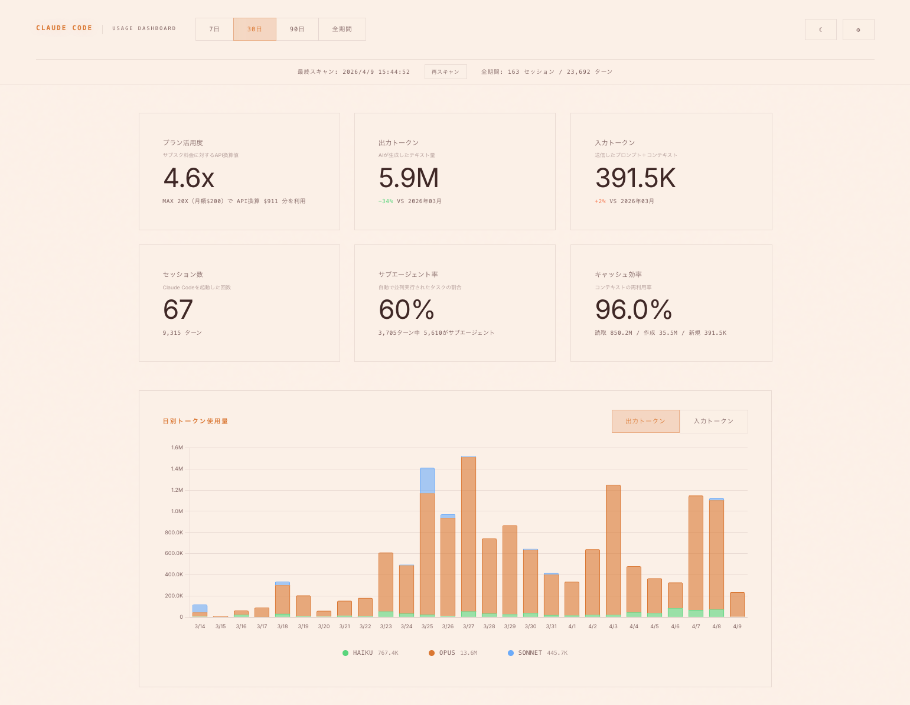
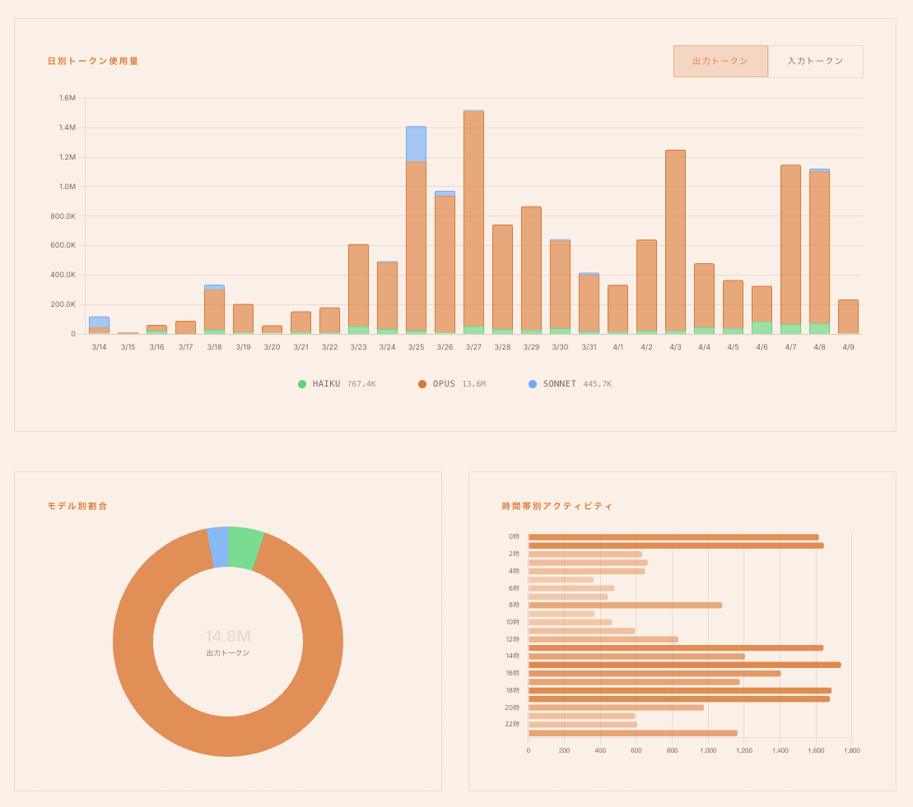

# Claude Code Usage Dashboard

> Claude Codeの使用量をブラウザで可視化するローカルダッシュボード

Claude Codeが `~/.claude/projects/` に自動保存するJSONLログを解析し、トークン使用量・セッション履歴・プロジェクト別統計をリアルタイムで表示します。

データは一切外部に送信されません。すべてローカルで完結します。





---

## 特徴

- **完全ローカル** — 外部API・外部送信なし。SQLiteに集約してブラウザで表示
- **ゼロ依存** — Python標準ライブラリのみ（Python 3.8以上）
- **ワンコマンド起動** — Claude Codeで `/usage` と入力するだけ
- **完全日本語UI** — ラベル・説明・ヒントすべて日本語
- **ダーク / ライトテーマ** — CC for Businessのデザイントーンを踏襲

## できること

| 機能 | 説明 |
|------|------|
| サマリーカード | プラン活用度・出力/入力トークン・セッション数・サブエージェント率・キャッシュ効率を一覧表示 |
| 日別チャート | モデル別（Opus / Sonnet / Haiku）のトークン使用量を積み上げ棒グラフで表示。出力/入力をタブ切替 |
| モデル別割合 | 期間内のモデル使用比率をドーナツチャートで可視化 |
| 時間帯別アクティビティ | 24時間の利用パターンを横棒グラフで表示（JST） |
| プロジェクト別集計 | プロジェクトごとのセッション数・ターン数・モデル内訳バーを表示 |
| セッション振り返り | 日付を選んでその日のセッション一覧とプロンプト履歴を確認 |
| キャッシュ効率バー | キャッシュ読取 / 作成 / 新規入力の比率を可視化 |
| プラン活用度 | サブスク料金に対するAPI換算値で「どれだけ活用できているか」を表示 |

---

## インストール

### 必要なもの

- Python 3.8以上
- Claude Code（ログが `~/.claude/projects/` に保存されていること）

### 手順

```bash
git clone https://github.com/st-dev0/claude-code-usage-jp.git
cd claude-code-usage-jp
./install.sh
```

これだけで完了です。`~/.claude/tools/usage-dashboard/` にファイルがコピーされ、`/usage` スラッシュコマンドが登録されます。

---

## 使い方

### スラッシュコマンド（推奨）

Claude Codeのプロンプトで：

```
/usage
```

ダッシュボードがブラウザで自動的に開きます。

### 手動起動

```bash
python3 ~/.claude/tools/usage-dashboard/start.py
```

#### オプション

| フラグ | 説明 |
|--------|------|
| `--port 3000` | ポート番号を指定（デフォルト: 8080） |
| `--no-browser` | ブラウザを自動で開かない |
| `--rescan` | 全ファイルを再スキャン（キャッシュ無視） |

---

## 仕組み

```
~/.claude/projects/**/conversation.jsonl
        ↓ scanner.py（解析・集約）
~/.claude/usage-jp.db（SQLite）
        ↓ server.py（API配信）
dashboard.html（ブラウザで表示）
```

1. **scanner.py** — Claude Codeのログ（JSONL）をパースし、ターンごとのトークン数・モデル・コスト等をSQLiteに格納
2. **server.py** — SQLiteを読み取り、期間別・プロジェクト別・日別等のAPIを提供
3. **dashboard.html** — Chart.jsで可視化。すべてローカルHTTPで完結

---

## プライバシー

- データは `~/.claude/usage-jp.db`（ローカルSQLite）に保存されます
- 外部サーバーへの通信は一切ありません
- CDNから Chart.js と Google Fonts を読み込みますが、これはブラウザキャッシュ済みの一般的なライブラリです
- ダッシュボードはローカルHTTPサーバー（`localhost`）でのみアクセス可能です

---

## カスタマイズ

### テーマ

ヘッダーの太陽/月アイコンでダーク/ライトテーマを切り替えられます。設定はSQLiteに保存され、次回起動時も維持されます。

### プラン設定

ヘッダーの歯車アイコンから、利用中のプラン（Pro / Max 5x / Max 20x）を選択できます。プラン活用度の計算に使用されます。

---

## アンインストール

```bash
rm -rf ~/.claude/tools/usage-dashboard
rm ~/.claude/commands/usage.md
rm ~/.claude/usage-jp.db
```

---

## 技術スタック

- **Python 3** — 標準ライブラリのみ（json, sqlite3, http.server, pathlib等）
- **Chart.js** — グラフ描画（CDN）
- **Inter** — UIフォント（Google Fonts）
- **SQLite** — データ永続化

---

## ライセンス

[MIT License](LICENSE) - Copyright (c) 2026 Fyve Inc.
